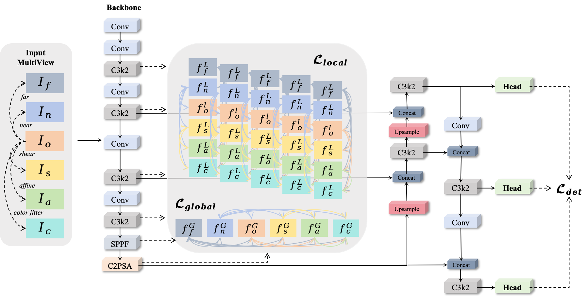

## A Multi-view Feature Enhancement Detection Method Integrating Consistency and Complementarity

## Introduction
This is our PyTorch implementation of the paper "[`A Multi-view Feature Enhancement Detection Method Integrating Consistency and Complementarity`].

<div align="center">
    
</div>

## <div align="left">Quick Start Examples</div>

<details open>
<summary>Install</summary>

First, clone the project and configure the environment.

```bash
export WANDB_MODE=disabled
conda activate DA #debug
conda activate ObjectDetection #train

# clone the project and configure the environment.
git clone https://github.com/LiuJiaji1999/HFDNet.git
# the version of ultralytics is '8.3.9'           
# GPU-NVIDIA GeForce RTX 3090 
# CPU-12th Gen Intel(R) Core(TM) i9-12900
python: 3.8.18
torch:  1.12.0+cu113
torchvision: 0.13.0+cu113 
numpy: 1.22.3
```

</details>

<details open>
<summary>Train</summary>

```shell
python train.py
```
</details>


<details open>
<summary>Test</summary>

```bash
python val.py
```
</details>


### Experimental flow chart

<div align="center">
    
</div>


### Detection result
<div align="center">
    
</div>

<div align="center">
    
</div>


#### Explanation of the file
```bash
1. train.py ：训练模型的脚本
2. main_profile.py ：输出模型和模型每一层的参数,计算量的脚本
3. val.py ：使用训练好的模型计算指标的脚本
4. detect.py ： 推理的脚本
5. track.py：跟踪推理的脚本
6. test_yaml.py：用来测试所有yaml是否能正常运行的脚本
7. heatmap.py ：生成热力图的脚本
8. get_FPS.py ：计算模型储存大小、模型推理时间、FPS的脚本
    FPS最严谨来说就是1000(1s)/(preprocess+inference+postprocess),
    ✅没那么严谨的话就是只除以inference的时间
9. get_COCO_metrice.py：计算COCO指标的脚本
10. plot_result.py：绘制曲线对比图的脚本
11. transform_PGI.py去掉PGI模块.
12. export.py：  导出onnx脚本.
13. get_model_erf.py ： 绘制模型的有效感受野.
```

###### input
```bash
print('一. trainer.py/get_dataset 先从yaml文件获取 train')
print('二. trainer.py/get_dataloader 开始加载训练数据')
print('三. detect/train.py/build_dataset 开始真正构建数据集')
print('四. bulid.py/build_yolo_dataset 构建YOLO数据集')
print('五. dataset.py/build_transforms 开始数据增强')
print('六. augment.py/v8_transforms 开始执行数据增强函数，') #随机增强方式直接替换原图送进模型    
print('七.ultralytics/data/base.py/get_image_and_label，数据增强后的图片-标签对应'）
```


