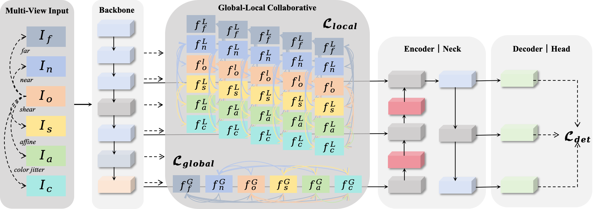
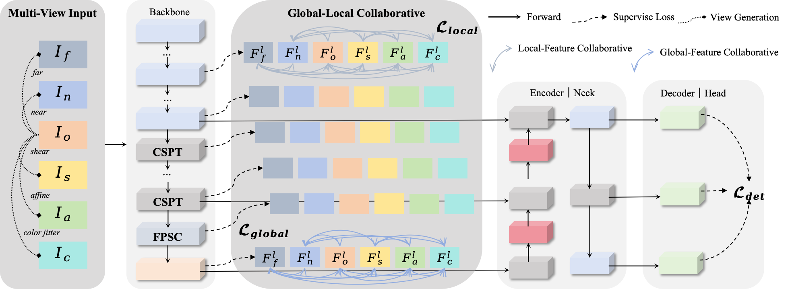

## Multi-View Object Detection

## 💡Introduction
This is our PyTorch implementation of the paper "[`A multi-view feature collaborative optimization method for object detection`].
<!-- ```bash
Model Version 1
```
<div align="center">
    
</div>

```bash
Model Version 2
```
<div align="center">
    
</div> -->

## 🚩Dataset
```bash
/dataset/powerdata.yaml: Private Power Data 
    # Due to the signing of a confidentiality agreement, this dataset is not publicly available at this time.
/dataset/publicallpower.yaml: Public Power Data
    # CPLID: https://github.com/InsulatorData/InsulatorDataSet
    # IDID: https://ieee-dataport.org/competitions/insulator-defect-detection
    # VPMBGI: https://github.com/phd-benel/VPMBGI
/dataset/VisDrone.yaml:VisDrone2019-DET 
    # https://github.com/VisDrone/VisDrone-Dataset
other
```

## 🛠️Quick Start Examples

<details open>
<summary>Install</summary>

```bash
export WANDB_MODE=disabled
conda activate DA #debug
conda activate ObjectDetection #train

# clone the project and configure the environment.
git clone https://github.com/LiuJiaji1999/MFCO.git
# the version of ultralytics is '8.3.9'           
# GPU - 24G NVIDIA GeForce RTX 3090 
# CPU - 12th Gen Intel(R) Core(TM) i9-12900
pip install -r OD-requirements.txt
attention:
  - opencv-python==4.9.0.80
  - opencv-python-headless==4.9.0.80
  - torch==1.9.0
  - torchvision==0.13.0+cu113
  - torchaudio==0.12.0+cu113
```

</details>

<details open>
<summary>Train</summary>

```shell
python train.py 
# save outputlog
nohup python train.py > /log/XXX.log 2>&1 & tail -f /log/XXX.log
```
</details>


<details open>
<summary>Test</summary>

```bash
Since github cannot push big file, we put '.pt' into the Google Drive,so you can directly test :
# https://drive.google.com/drive/folders/1SSlZEZvlthQqWaZFEPYCWwkEe-40fqsX
python val.py # test dataset 
python detect.py # Visualization of detect results
nohup python feature.py > /home/lenovo/data/liujiaji/powerGit/mvod/log/feature.log 2>&1 & tail -f /home/lenovo/data/liujiaji/powerGit/mvod/log/feature.log 
```
</details>

#### 📢Plan
```bash
We will modify network to the enabling fair comparison with other MVOD methods.
    - ✅ MFFN-YOLO：https://github.com/zhanxn666/newtask (Camouflaged Object Detection)
    - 
And thanks again to the sprirt of the open-source:https://github.com/stars/LiuJiaji1999/lists/mvod
```


#### 📝RT-DETR result
```bash
/rtdetr
model: rtdetr-l.yaml
datasets: Private Power Data, Public Power Data, VisDrone2019-DET
(640, 640)+ours: CUDA out of Memory
```
| Method | pin-un | pin-ru | pin-de | insulator-bu | insulator-de | insulator-di | mAP(%) |
|---|---|---|---|---|---|---|---|
| (640,640) | 22.3| 67.3 |48.0  |71.5  |69.0  |29.9  | 51.3 |
| (640,640)+ours | -| - |-  |-  |- | - | - |
|(384,384) | 6.04 | 48.4 | 28.0 | 54.7 | 45.8 | 23.4 | 34.4 |
| (384,384)+ours | 10.6 | 57.4 | 33.1 | 66.0 | 66.6 | 35.2 | 44.8 |

| Method | CPLID-defect | VPMBGI-defect | IDID-flashover | IDID-broken | mAP(%) |
|---|---|---|---|---|---|
|(640,640) | 99.5 |89.6|94.1 |94.7 | 94.5 |
| (640,640)+ours |-| - | - | - | -|
| (384,384) | 97.9 | 80.1 | 81.0 | 82.5 | 85.4 |
| (384,384)+ours | 99.5 | 99.7 | 88.4 | 94.5 | 92.8 |


| Method | ign-reg | ped | peo | bic | car | van | tru | tri | aw-tri | bus | mAP (%) |
|---|---|---|---|---|---|---|---|---|---|---|---|
| (640, 640) | 38.9 | 28.0 | 14.9 | 79.1 | 41.3 | 46.2 | 28.5 | 18.7 | 56.8 | 42.7 | 39.5 |
| (640,640)+ours | - | - | - | - | - | - | - | - | - | - | - |
| (384, 384) | 19.3 | 14.9 | 6.0 | 66.4 | 29.7 | 32.0 | 14.6 | 11.2 | 44.6 | 23.9 | 26.3 |
| (384,384)+ours | 23.5 | 19.2 | 5.3 | 69.6 | 30.1 | 36.4 | 16.0 | 14.4 | 53.0 | 28.3 | 29.6 |


#### 🌟Explanation of the file
```bash
1. main_profile.py ：model.info
2. test_yaml.py ：test all yaml is run 
3. heatmap.py ：heatmap
4. get_FPS.py ：compute model param、inference-time、FPS
5. get_model_erf.py ： erf
6. test_other.py ： debug
7. plot_result.py：visualize loss and metrics
8. plot_all.py:visualize loss and metrics in one picture
9. feature.py：visualize feature distributions
```

<details >
<summary>Personal Debug</summary>

```bash
print('一. trainer.py/get_dataset 先从yaml文件获取 train')
print('二. trainer.py/get_dataloader 开始加载训练数据')
print('三. detect/train.py/build_dataset 开始真正构建数据集')
print('四. bulid.py/build_yolo_dataset 构建YOLO数据集')
print('五. dataset.py/build_transforms 开始数据增强')
print('六. augment.py/v8_transforms 开始执行数据增强函数，') #随机增强方式直接替换原图送进模型    
print('七.ultralytics/data/base.py/get_image_and_label，数据增强后的图片-标签对应'）
```
</details>


